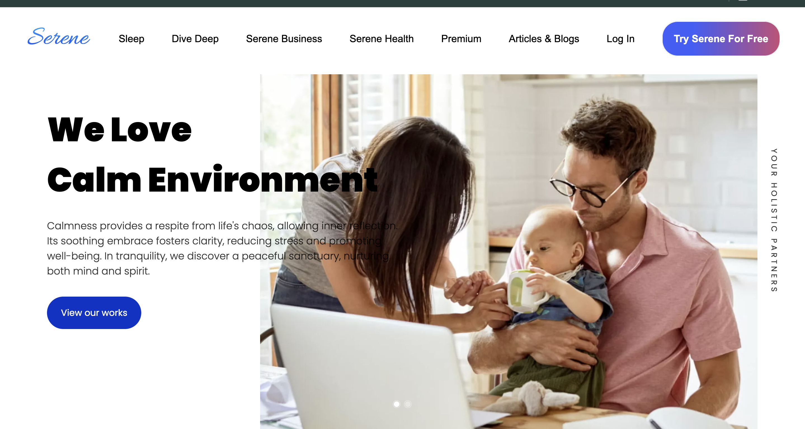

# Serene 🌿

Serene: Your Gateway to Tranquility. Dive into a serene environment designed to help you relax, meditate, and focus. Serene offers a variety of calming sounds, guided meditations, and mindfulness exercises to enhance your mental well-being.

## Overview 🌟

Serene is a web-based platform that aims to provide users with a peaceful and relaxing experience. Whether you are looking to reduce stress, improve your focus, or simply unwind, Serene has something for you. Built using HTML, CSS, JavaScript, and PHP, Serene is easy to set up and run locally.

## Features 🌈

- **Relaxing Sounds**: Choose from a variety of ambient sounds and music to create a calming atmosphere.
- **Guided Meditations**: Access a library of guided meditations to help you relax and focus.
- **Mindfulness Exercises**: Engage in exercises designed to promote mindfulness and mental clarity.
- **User-Friendly Interface**: Enjoy a seamless and intuitive user experience.
- **3D Environment**: Drive into nature using our 3D environment.

## Getting Started 🚀

Follow these steps to set up and run Serene on your local machine.

### Prerequisites 📋

- **XAMPP**: A free and open-source cross-platform web server solution stack package developed by Apache Friends, consisting mainly of the Apache HTTP Server, MariaDB database, and interpreters for scripts written in the PHP and Perl programming languages.
- **Web Browser**: Any modern web browser like Chrome, Firefox, or Safari.

### UI





### Installation Steps 🔧

1. **Clone the Repository**
   ```bash
   git clone https://github.com/YourUsername/Serene.git
   ```

2. **Start Website**
```bash
    Open XAMPP and start the Apache server.
    Move the cloned repository to the htdocs folder in the XAMPP directory.
    Open your web browser and go to http://localhost/Serene/index.html.
```
3. **Explore Website**
```bash
    Explore the website and enjoy the calming experience.
```
4. **Note: Connect the Database created in php/myadmin**
